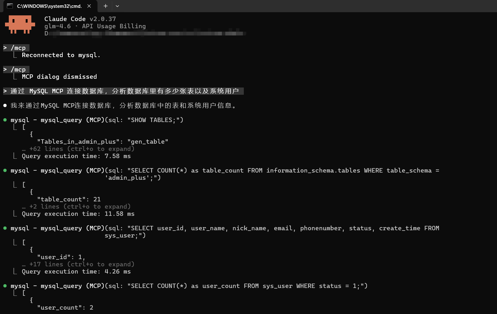
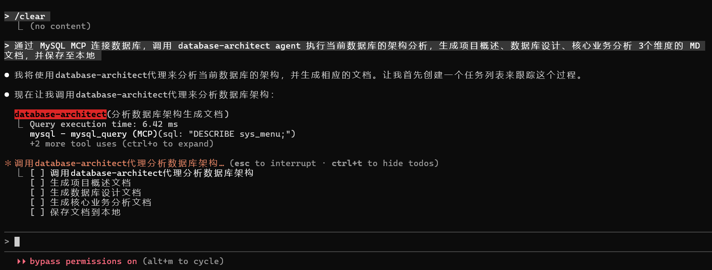
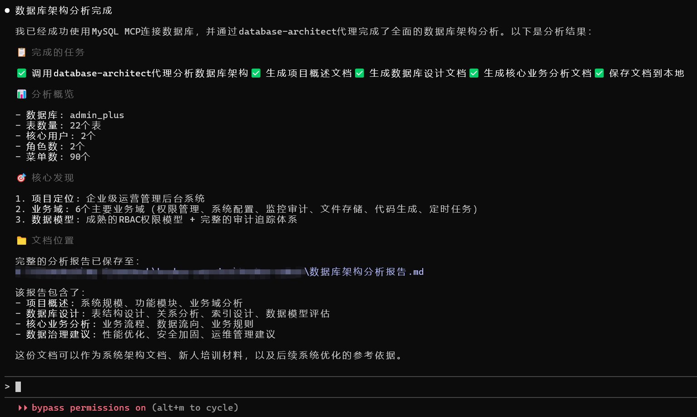

# MySQL MCP 服务 - Claude Code

> **🚀 这是一个优化版，适用于最新版本 Claude Code **
> 
> ** 原项目地址：** https://github.com/benborla/mcp-server-mysql
>
> **许可证：** MIT

# 基于 NodeJS 的 MySQL MCP 服务

> **🌟该项目如对您有帮助，欢迎点赞🌟**

### 此分支的主要特点：

- ✅ **最新 Claude Code 兼容** - 完全兼容最新版本的 Claude Code CLI，提供稳定的数据库访问体验
- ✅ **增强数据库访问验证** - 当设置 `MYSQL_DB` 时，严格验证 SQL 查询的数据库访问，确保查询只作用于指定数据库，避免意外的跨库操作
- ✅ **SSH 隧道支持** - 内置支持远程数据库的 SSH 隧道
- ✅ **自动启动 / 停止钩子** - 与 Claude 启动 / 停止配合的自动隧道管理
- ✅ **DDL 操作** - 添加了 `MYSQL_DISABLE_READ_ONLY_TRANSACTIONS` 以支持 `CREATE TABLE`
- ✅ **多项目设置** - 轻松配置多个具有不同数据库的项目

### Claude Code 用户快速入门：

1. **阅读设置指南**：详见 [PROJECT_SETUP_GUIDE.md](PROJECT_SETUP_GUIDE.md) 获取详细说明
2. **配置 SSH 隧道**：为远程数据库设置自动 SSH 隧道
3. **与 Claude 配合使用**：集成的 MCP 服务与 Claude Code 无缝协作

一个模型上下文协议服务器，通过 SSH 隧道提供对 MySQL 数据库的访问。该服务器使 Claude 和其他大型语言模型能够安全地检查数据库模式和执行 SQL 查询。

## 目录

- [要求](#要求)
- [安装](#安装)
  - [Claude Code](#claude-code)
  - [从本地仓库运行](#从本地仓库运行)
  - [以全局模式安装运行](#以全局模式安装运行)
- [组件](#组件)
  - [工具](#工具)
  - [资源](#资源)
  - [安全功能](#安全功能)
  - [性能优化](#性能优化)
  - [监控和调试](#监控和调试)
- [配置](#配置)
  - [高级配置选项](#高级配置选项)
- [环境变量](#环境变量)
  - [基本连接](#基本连接)
  - [性能配置](#性能配置)
  - [安全配置](#安全配置)
  - [监控配置](#监控配置)
- [多数据库模式](#多数据库模式)
- [模式特定权限](#模式特定权限)
- [测试](#测试)
  - [数据库设置](#数据库设置)
  - [运行测试](#运行测试)
- [运行评估](#运行评估)
- [故障排除](#故障排除)
- [许可证](#许可证)
- [贡献](#贡献)
- [原项目](#原项目)

## 要求

- Node.js v22 或更高版本
- MySQL 5.7 或更高版本（推荐 MySQL 8.0+）
- 具有所需操作适当权限的 MySQL 用户
- 对于写入操作：具有 INSERT、UPDATE 和 DELETE 权限的 MySQL 用户

## 安装

### Claude Code

本项目专为 Claude Code CLI 优化，提供完整的 MySQL 数据库访问功能。请按照下方的安装指南进行配置。

### 从本地仓库运行

如果直接从源代码克隆并运行此 MCP 服务，请按照以下步骤操作：
> 👉代码地址：[github](https://github.com/chenlinyang/mcp-server-mysql) 或 [gitee](https://gitee.com/chenlinyang/mcp-server-mysql)

1. **克隆仓库**

   ```bash
   git clone https://github.com/chenlinyang/mcp-server-mysql.git
   cd mcp-server-mysql
   ```

2. **安装依赖项**

   ```bash
   npm install
   # 或
   pnpm install
   ```

3. **构建项目**

   ```bash
   npm run build
   # 或
   pnpm run build
   ```

4. **配置 Claude Code CLI**

   将以下内容添加到您的 Claude Code CLI配置文件（Linux和MacOS一般是`~/.claude.json`，windows一般是`%USERPROFILE%/.claude.json`）：

   ```json
   {
     "mcpServers": {
       "mcp_server_mysql": {
         "command": "/path/to/node",
         "args": [
           "/full/path/to/mcp-server-mysql/dist/index.js"
         ],
         "env": {
           "MYSQL_HOST": "127.0.0.1",
           "MYSQL_PORT": "3306",
           "MYSQL_USER": "root",
           "MYSQL_PASS": "your_password",
           "MYSQL_DB": "your_database",
           "MULTI_DB_WRITE_MODE": "false",
           "ALLOW_INSERT_OPERATION": "false",
           "ALLOW_UPDATE_OPERATION": "false",
           "ALLOW_DELETE_OPERATION": "false"
         }
       }
     }
   }
   ```

   替换：

   - `/path/to/node` 为 Node.js 二进制文件的完整路径（使用 `which node` 找到它）
   - `/full/path/to/mcp-server-mysql` 为您克隆仓库的完整路径
   - 设置 MySQL 凭据以匹配您的环境

5. **测试服务**

   ```bash
   # 直接运行服务进行测试
   node dist/index.js
   ```

   如果它成功连接到 MySQL，您就可以将其与 Claude Code CLI一起使用了。

### 以全局模式安装运行

1. **全局安装**

   ```bash
   # 全局安装
   npm install -g @chenlinyang/mcp-server-mysql

   # 或者使用 pnpm
   pnpm add -g @chenlinyang/mcp-server-mysql
   ```

2. **配置 Claude Code CLI**
- **方法一：使用命令行**

   ```bash
   claude mcp add -s user mysql -- npx -y "@chenlinyang/mcp-server-mysql"
   ```

- **方法二：手动配置**

   将以下内容添加到您的 Claude Code CLI 配置文件（`.claude.json`）：

   ```json
   {
     "mcpServers": {
       "mcp_server_mysql": {
         "command": "npx",
         "args": [
           "@chenlinyang/mcp-server-mysql"
         ],
         "env": { }
       }
     }
   }
   ```

3. **在首选目录中创建 .env 文件**

   ```bash
   # 创建 .env 文件
   touch .env
   ```

   将此仓库中的 .env 文件内容复制粘贴到您刚创建的 .env 文件中。

4. **验证**

   添加服务后，验证其配置是否正确：

   ```bash
# 列出所有配置的MCP服务
claude mcp list

# 获取 MySQL 服务器的详细信息
claude mcp get mcp_server_mysql

# 在 Claude Code 中检查服务状态
/mcp
```


- 执行简单的统计分析



- 结合agent进行架构分析





## 组件

### 工具

- mysql_query
  - 对连接的数据库执行 SQL 查询
  - 输入：`sql`（字符串）：要执行的 SQL 查询
  - 默认情况下，仅限于只读操作
  - 可选的写入操作（当通过配置启用时）：
    - INSERT：向表中添加新数据（需要 `ALLOW_INSERT_OPERATION=true`）
    - UPDATE：修改现有数据（需要 `ALLOW_UPDATE_OPERATION=true`）
    - DELETE：删除数据（需要 `ALLOW_DELETE_OPERATION=true`）
  - 所有操作都在事务中执行，并具有适当的提交 / 回滚处理
  - 支持预准备语句以安全处理参数
  - 可配置的查询超时和结果分页
  - 内置查询执行统计信息

### 资源

服务提供全面的数据库信息：

- 表模式
  - 每个表的 JSON 模式信息
  - 列名和数据类型
  - 索引信息和约束
  - 外键关系
  - 表统计信息和指标
  - 从数据库元数据自动发现

### 安全功能

- 通过预准备语句防止 SQL 注入
- **增强数据库访问控制** - 当设置 `MYSQL_DB` 时，自动验证并阻止跨数据库查询，确保数据安全
- 查询白名单 / 黑名单功能
- 查询执行速率限制
- 查询复杂度分析
- 可配置的连接加密
- 只读事务强制

### 性能优化

- 优化的连接池
- 查询结果缓存
- 大结果集流
- 查询执行计划分析
- 可配置的查询超时

### 监控和调试

- 全面的查询日志记录
- 性能指标收集
- 错误跟踪和报告
- 健康检查端点
- 查询执行统计信息

## 配置

您可以更新任何 MySQL 连接详细信息以及写入操作设置：

- **基本连接设置**：
  - MySQL 主机、端口、用户、密码、数据库
  - SSL/TLS 配置（如果您的数据库需要安全连接）
- **写入操作权限**：
  - 允许 INSERT 操作：如果您希望允许添加新数据，请设置为 true
  - 允许 UPDATE 操作：如果您希望允许更新现有数据，请设置为 true
  - 允许 DELETE 操作：如果您希望允许删除数据，请设置为 true

出于安全原因，所有写入操作默认都是禁用的。只有在您特别需要 Claude 修改数据库数据时才启用这些设置。

### 高级配置选项

要更好地控制 MCP 服务的行为，您可以使用这些高级配置选项：

```json
{
  "mcpServers": {
    "mcp_server_mysql": {
      "command": "/path/to/npx/binary/npx",
      "args": [
        "-y",
        "@chenlinyang/mcp-server-mysql"
      ],
      "env": {
        // 基本连接设置
        "MYSQL_HOST": "127.0.0.1",
        "MYSQL_PORT": "3306",
        "MYSQL_USER": "root",
        "MYSQL_PASS": "",
        "MYSQL_DB": "db_name",
        "PATH": "/path/to/node/bin:/usr/bin:/bin",

        // 性能设置
        "MYSQL_POOL_SIZE": "10",
        "MYSQL_QUERY_TIMEOUT": "30000",
        "MYSQL_CACHE_TTL": "60000",

        // 安全设置
        "MYSQL_RATE_LIMIT": "100",
        "MYSQL_MAX_QUERY_COMPLEXITY": "1000",
        "MYSQL_SSL": "true",

        // 监控设置
        "MYSQL_ENABLE_LOGGING": "true",
        "MYSQL_LOG_LEVEL": "info",
        "MYSQL_METRICS_ENABLED": "true",

        // 写入操作标志
        "ALLOW_INSERT_OPERATION": "false",
        "ALLOW_UPDATE_OPERATION": "false",
        "ALLOW_DELETE_OPERATION": "false"
      }
    }
  }
}
```

## 环境变量

### 基本连接

- `MYSQL_SOCKET_PATH`：本地连接的 Unix 套接字路径（例如，"/tmp/mysql.sock"）
- `MYSQL_HOST`：MySQL 服务器主机（默认："127.0.0.1"）- 如果设置了 MYSQL_SOCKET_PATH，则忽略
- `MYSQL_PORT`：MySQL 服务器端口（默认："3306"）- 如果设置了 MYSQL_SOCKET_PATH，则忽略
- `MYSQL_USER`：MySQL 用户名（默认："root"）
- `MYSQL_PASS`：MySQL 密码
- `MYSQL_DB`：目标数据库名称（多数据库模式留空）- **增强功能**：设置后将严格限制查询只访问此数据库，防止意外的跨库操作

### 性能配置

- `MYSQL_POOL_SIZE`：连接池大小（默认："10"）
- `MYSQL_QUERY_TIMEOUT`：查询超时（毫秒）（默认："30000"）
- `MYSQL_CACHE_TTL`：缓存生存时间（毫秒）（默认："60000"）

### 安全配置

- `MYSQL_RATE_LIMIT`：每分钟最大查询数（默认："100"）
- `MYSQL_MAX_QUERY_COMPLEXITY`：最大查询复杂度分数（默认："1000"）
- `MYSQL_SSL`：启用 SSL/TLS 加密（默认："false"）
- `ALLOW_INSERT_OPERATION`：启用 INSERT 操作（默认："false"）
- `ALLOW_UPDATE_OPERATION`：启用 UPDATE 操作（默认："false"）
- `ALLOW_DELETE_OPERATION`：启用 DELETE 操作（默认："false"）
- `ALLOW_DDL_OPERATION`：启用 DDL 操作（默认："false"）
- `MYSQL_DISABLE_READ_ONLY_TRANSACTIONS`：**[新增]** 禁用只读事务强制（默认："false"）⚠️ **安全警告：** 仅在您需要完全写入权限且信任 LLM 处理您的数据库时启用此功能
- `SCHEMA_INSERT_PERMISSIONS`：模式特定的 INSERT 权限
- `SCHEMA_UPDATE_PERMISSIONS`：模式特定的 UPDATE 权限
- `SCHEMA_DELETE_PERMISSIONS`：模式特定的 DELETE 权限
- `SCHEMA_DDL_PERMISSIONS`：模式特定的 DDL 权限
- `MULTI_DB_WRITE_MODE`：在多数据库模式下启用写入操作（默认："false"）

### 监控配置

- `MYSQL_ENABLE_LOGGING`：启用查询日志记录（默认："false"）
- `MYSQL_LOG_LEVEL`：日志级别（默认："info"）
- `MYSQL_METRICS_ENABLED`：启用性能指标（默认："false"）

## 多数据库模式

当未设置特定数据库时，MCP-Server-MySQL 支持连接到多个数据库。这允许 LLM 查询 MySQL 用户有权访问的任何数据库。有关完整详情，请参见 [README-MULTI-DB.md](README-MULTI-DB.md)。

### 启用多数据库模式

要启用多数据库模式，只需将 `MYSQL_DB` 环境变量留空。在多数据库模式下，查询需要模式限定：

```sql
-- 使用完全限定的表名
SELECT * FROM database_name.table_name;

-- 或者使用 USE 语句在数据库之间切换
USE database_name;
SELECT * FROM table_name;
```

## 模式特定权限

为了对数据库操作进行细粒度控制，MCP-Server-MySQL 现在支持模式特定权限。这允许不同的数据库具有不同的访问级别（只读、读写等）。

### 配置示例

```txt
SCHEMA_INSERT_PERMISSIONS=development:true,test:true,production:false
SCHEMA_UPDATE_PERMISSIONS=development:true,test:true,production:false
SCHEMA_DELETE_PERMISSIONS=development:false,test:true,production:false
SCHEMA_DDL_PERMISSIONS=development:false,test:true,production:false
```

有关完整详情和安全建议，请参见 [README-MULTI-DB.md](README-MULTI-DB.md)。

## 测试

### 数据库设置

运行测试前，您需要设置测试数据库并填充测试数据：

1. **创建测试数据库和用户**

   ```sql
   -- 以 root 身份连接并创建测试数据库
   CREATE DATABASE IF NOT EXISTS mcp_test;
   
   -- 创建具有适当权限的测试用户
   CREATE USER IF NOT EXISTS 'mcp_test'@'localhost' IDENTIFIED BY 'mcp_test_password';
   GRANT ALL PRIVILEGES ON mcp_test.* TO 'mcp_test'@'localhost';
   FLUSH PRIVILEGES;
   ```

2. **运行数据库设置脚本**

   ```bash
   # 运行数据库设置脚本
   npm run setup:test:db
   ```

   这将创建必要的表和种子数据。该脚本位于 `scripts/setup-test-db.ts`

3. **配置测试环境**

   在项目根目录中创建 `.env.test` 文件（如果不存在）：

   ```env
   MYSQL_HOST=127.0.0.1
   MYSQL_PORT=3306
   MYSQL_USER=mcp_test
   MYSQL_PASS=mcp_test_password
   MYSQL_DB=mcp_test
   ```

4. **更新 package.json 脚本**

   将这些脚本添加到您的 package.json：

   ```json
   {
     "scripts": {
       "setup:test:db": "ts-node scripts/setup-test-db.ts",
       "pretest": "pnpm run setup:test:db",
       "test": "vitest run",
       "test:watch": "vitest",
       "test:coverage": "vitest run --coverage"
     }
   }
   ```

### 运行测试

该项目包括一个全面的测试套件，以确保功能和可靠性：

```bash
# 首次设置
pnpm run setup:test:db

# 运行所有测试
pnpm test
```

## 运行评估

评估包加载一个 mcp 客户端，然后运行 index.ts 文件，因此测试之间无需重建。您可以通过前缀 npx 命令来加载环境变量。完整文档可在 [MCP Evals](https://www.mcpevals.io/docs) 找到。

```bash
OPENAI_API_KEY=your-key  npx mcp-eval evals.ts index.ts
```

## 故障排除

### 常见问题

1. **连接问题**

   - 验证 MySQL 服务器是否正在运行且可访问
   - 检查凭据和权限
   - 如果启用，确保 SSL/TLS 配置正确
   - 尝试使用 MySQL 客户端连接以确认访问权限

2. **性能问题**

   - 调整连接池大小
   - 配置查询超时值
   - 必要时启用查询缓存
   - 检查查询复杂度设置
   - 监控服务器资源使用情况

3. **安全限制**

   - 查看速率限制配置
   - 检查查询白名单 / 黑名单设置
   - 验证 SSL/TLS 设置
   - 确保用户具有适当的 MySQL 权限

4. **数据库访问验证问题**

   - 如果设置了 `MYSQL_DB` 但仍然收到跨数据库访问错误，请检查 SQL 查询中是否明确指定了数据库名称
   - 确保所有表引用都指向正确的数据库，使用 `database.table` 格式或先执行 `USE database` 语句
   - 在单数据库模式下，系统会自动阻止对其他数据库的访问以提高安全性

5. **路径解析**

   如果遇到错误 "Could not connect to MCP server mcp-server-mysql"，显式设置所有必需二进制文件的路径：

   ```json
   {
     "env": {
       "PATH": "/path/to/node/bin:/usr/bin:/bin"
     }
   }
   ```

   **我在哪里可以找到我的 `node` 二进制路径？**

   运行以下命令获取：

   - 对于 **PATH**：

     ```bash
     echo "$(which node)/../"
     ```

   - 对于 **NODE_PATH**：

     ```bash
     echo "$(which node)/../../lib/node_modules"
     ```

## 许可证

本项目基于 MIT 许可证开源。详见 [LICENSE](LICENSE) 文件。

## 贡献

欢迎提交 Issue 和 Pull Request 来改进这个项目。

## 原项目

本项目是基于 [@benborla29](https://github.com/benborla) 的 [mcp-server-mysql](https://github.com/benborla/mcp-server-mysql) 项目的优化版本，专门针对 Claude Code 进行了增强优化。